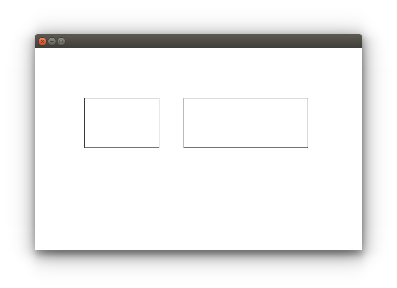

A simple demo application in Rust with basic XCB operations – connecting to the X server, window creation, drawing polygons and XCB event loop handling. A nice way to explore Rust FFI capabilities.

